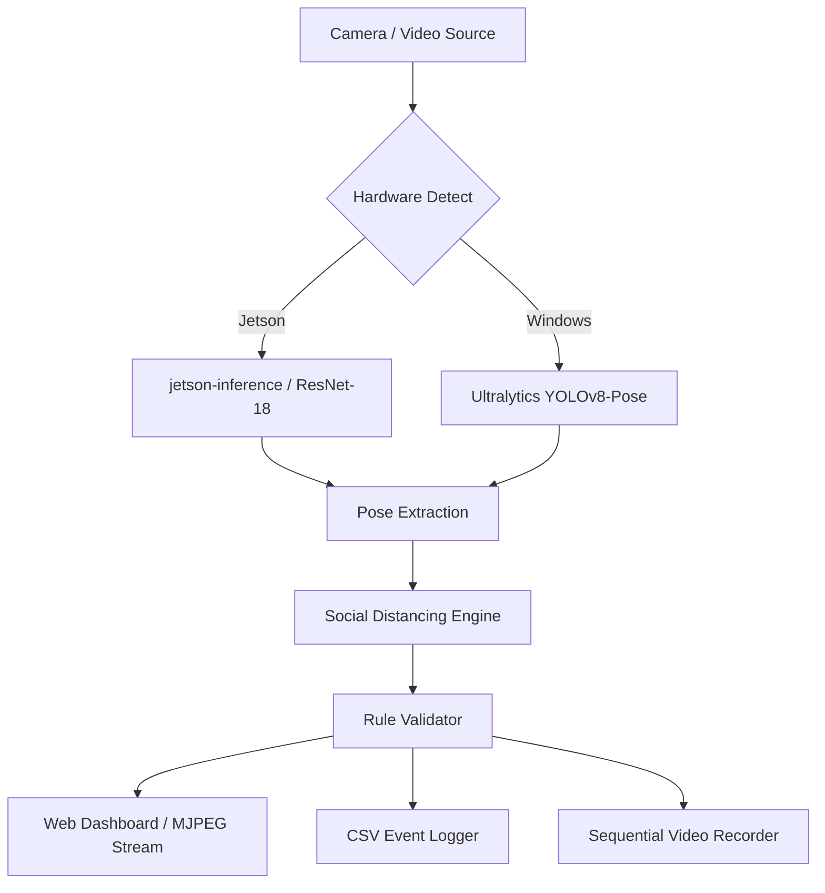

# Eagle Vision: Social Distancing & Anomaly Detection

[](https://www.python.org/downloads/)
[](https://www.nvidia.com/en-us/autonomous-machines/embedded-systems/jetson-orin/)
[]()

## Project Positioning

This project is designed as a **real-time edge AI monitoring system** for analyzing human behavior using pose-based computer vision.

Unlike traditional object detection approaches that rely on bounding boxes, this system uses **human pose estimation** to achieve more context-aware analysis. By leveraging body keypoints instead of coarse detections, the system enables:

- More accurate interpersonal distance estimation
- Perspective-aware scaling based on body proportions
- Basic human activity recognition (e.g., walking, sitting, fallen)

The system is built to run efficiently on **edge devices such as the NVIDIA Jetson Orin Nano**, while also supporting a fallback mode for development environments without GPU acceleration.

This makes it suitable for:
- Smart surveillance systems
- Public space monitoring
- Edge AI research and prototyping

### Eagle Vision UI


## Key Features

- **Dual-Engine Support**: Automatically switches between `jetson-inference` (TensorRT accelerated) and `YOLOv8-pose` (Windows/CPU).
- **Animus-Themed Dashboard**: A high-end, responsive web interface with cinematic "Eagle Eye" shutter effects and "Desync" flicker animations.
- **Social Distancing Logic**: Real-time calculation of inter-person distances with visual alerts and automated CSV logging.
- **Sequential Recording**: Automatically saves test results into a `results/` folder as `output1.mp4`, `output2.mp4`, etc., ensuring no data is overwritten.
- **Fail-Safe Cleanup**: Graceful terminal interrupt handling to ensure video files are always finalized and playable.

## System Architecture



## Prediction Showcase


## Installation

### On Jetson (Docker)
Run inside the `jetson-inference` container for maximum performance:
```bash
sudo docker run -it --rm --runtime nvidia --network host \
  --volume ~/path/to/project:/workspace \
  dustynv/jetson-inference:r35.4.1
cd /workspace
python3 posenet_socialdistancing.py --input /dev/video0
```

**Access Dashboard:** `http://<jetson-ip>:5000`

### On Windows
```bash
pip install flask ultralytics opencv-python numpy
python posenet_socialdistancing.py --input 0
```

**Access Dashboard:** `http://localhost:5000`

## Usage

| Argument | Description | Default |
|----------|-------------|---------|
| `--input` | Video source (camera ID or file path) | `/dev/video0` |
| `--network` | PoseNet model to use | `resnet18-body` |
| `--distance` | Violation threshold in pixels | `150` |

### Terminal Shortcuts
- `Ctrl + C`: Safe shutdown (closes video writer and saves results).

## Project Structure

```text
.
├── engine/                 # Core logic and hardware abstraction
│   ├── pose_engine.py      # Dual-engine pose extraction
│   ├── social_logic.py     # Distancing & Violation math
│   └── logger.py           # CSV Data logging
├── results/                # Saved sequential video outputs
├── screenshots/            # UI and Preview images
├── static/                 # CSS/JS and UI assets
├── templates/              # HTML Dashboard
└── posenet_socialdistancing.py  # Main Entry Point
```

---
*Developed for advanced human monitoring and brotherhood protocols.*
